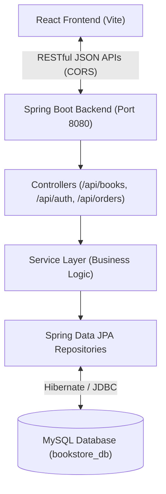

# 📚 LuminaBooks - Full-Stack Online Book Store

> A modern, responsive full-stack **Online Book Store** application designed with **React**, **Spring Boot**, and **MySQL**. Features a sleek dark glassmorphic UI, responsive layout, seamless REST API integration, and complete order management.

---

## 🌟 Key Features

- **🏠 Home Page**:
  - Hero banner with 3D-styled floating preview card and call-to-action buttons.
  - Featured and bestselling books showcase.
  - Interactive genre category cards (Technology, Sci-Fi, Self-Help, Finance, Fiction, Mystery).
  - Reader reviews, trust badges (free express shipping, genuine editions, 24/7 support), and newsletter subscription.

- **📖 Catalogue Page**:
  - Live real-time search by title, author, category, or ISBN.
  - Category pill quick-filters and multi-criteria sorting (Bestsellers, Price: Low to High, Price: High to Low, Rating).
  - Interactive **Book Detail Modal** with high-resolution cover preview, stock availability, synopsis, publication details, and quantity selector.

- **🔐 Authentication (Login & Registration)**:
  - **Login**: Email & password validation, toggle password visibility, and 1-click **Demo Account auto-fill**.
  - **Registration**: Form validation (name, email, password match, address), live password strength meter, and error alerts.

- **🛒 Cart & Checkout (Slide-Over Drawer)**:
  - Dynamic cart drawer with quantity adjustment counters and item removal.
  - Subtotal and free express shipping calculations.
  - Customizable shipping address and payment method options (Card, PayPal, COD).
  - Immediate order placement connected directly to the Spring Boot REST API.

- **📦 My Orders & Tracking**:
  - Order history tracking with unique order numbers (`ORD-XXXX`).
  - Itemized shipment breakdown with price summaries and status indicators (`PLACED`, `DELIVERED`).

---

## 🛠️ Architecture & Tech Stack



| Layer | Technologies Used |
| :--- | :--- |
| **Frontend** | React 18, Vite, Lucide Icons, Vanilla CSS (Design Tokens, Glassmorphism, Responsive Grid) |
| **State Management** | React Context API (`AuthContext`, `CartContext`) |
| **Backend** | Spring Boot 4 / 3, Java 25 / 17, Spring Data JPA, Hibernate, Maven |
| **Database** | MySQL 8.0 (InnoDB, Foreign Key Constraints, Indexes) |
| **API Format** | RESTful JSON with unified `ApiResponse<T>` wrapper and Global Exception Handling |

---

## 🗄️ Database Schema & Entities

The application utilizes MySQL with 4 interconnected tables:

1. **`users`**:
   - `id` (BIGINT, PK, AUTO_INCREMENT)
   - `full_name` (VARCHAR)
   - `email` (VARCHAR, UNIQUE)
   - `password` (VARCHAR)
   - `phone` (VARCHAR)
   - `address` (TEXT)
   - `role` (VARCHAR - `CUSTOMER` / `ADMIN`)
   - `created_at` (DATETIME)

2. **`books`**:
   - `id` (BIGINT, PK, AUTO_INCREMENT)
   - `title`, `author`, `isbn` (UNIQUE), `category`, `price`, `stock_quantity`, `rating`, `publication_year`, `featured`, `cover_image_url`, `description`

3. **`orders`**:
   - `id` (BIGINT, PK, AUTO_INCREMENT)
   - `order_number` (VARCHAR, UNIQUE)
   - `user_id` (FK -> `users.id`)
   - `order_date`, `total_amount`, `status`, `shipping_address`, `payment_method`

4. **`order_items`**:
   - `id` (BIGINT, PK, AUTO_INCREMENT)
   - `order_id` (FK -> `orders.id`)
   - `book_id` (FK -> `books.id`)
   - `quantity`, `unit_price`, `subtotal`

> **Note**: Complete DDL and seed scripts are located in [`src/main/resources/schema.sql`](src/main/resources/schema.sql) and [`src/main/resources/data.sql`](src/main/resources/data.sql).

---

## 🔌 REST API Documentation

### 1. Authentication (`/api/auth`)
- `POST /api/auth/register` — Register a new customer account
- `POST /api/auth/login` — Authenticate user and return session token
- `GET /api/auth/user/{id}` — Fetch user profile details

### 2. Books Catalog (`/api/books`)
- `GET /api/books` — Retrieve all books (supports `?category=...`)
- `GET /api/books/{id}` — Retrieve book by ID
- `GET /api/books/featured` — Retrieve featured bestselling books
- `GET /api/books/categories` — Get list of distinct genres/categories
- `GET /api/books/search?query=...` — Search books by keyword

### 3. Orders (`/api/orders`)
- `POST /api/orders` — Create a new order, calculate totals, and update stock
- `GET /api/orders/user/{userId}` — Retrieve order history for a user
- `GET /api/orders/{id}` — Retrieve detailed order by ID

---

## 🚀 Getting Started

### Prerequisites
- **Java 17+** (or Java 25)
- **Node.js 18+** & **npm**
- **MySQL 8.0+**

### 1. Backend Setup (Spring Boot)
1. Configure your MySQL credentials in [`src/main/resources/application.properties`](src/main/resources/application.properties):
   ```properties
   spring.datasource.url=jdbc:mysql://localhost:3306/bookstore_db?createDatabaseIfNotExist=true
   spring.datasource.username=root
   spring.datasource.password=root
   ```
2. Run the Spring Boot application using Maven:
   ```bash
   ./mvnw spring-boot:run
   ```
   The backend will start at `http://localhost:8080`. Sample books and demo users are seeded automatically.

### 2. Frontend Setup (React)
1. Navigate to the `frontend` directory:
   ```bash
   cd frontend
   ```
2. Install dependencies and start the dev server:
   ```bash
   npm install
   npm run dev
   ```
3. Open `http://localhost:5173` in your browser.

---

## 👤 Demo Credentials
For testing and grading convenience:
- **Email**: `alex@example.com`
- **Password**: `password123`
*(Or click the "Auto-fill Demo Account" button directly on the Sign In page!)*

---

## 📄 License
This project is developed for educational and academic submission purposes.
